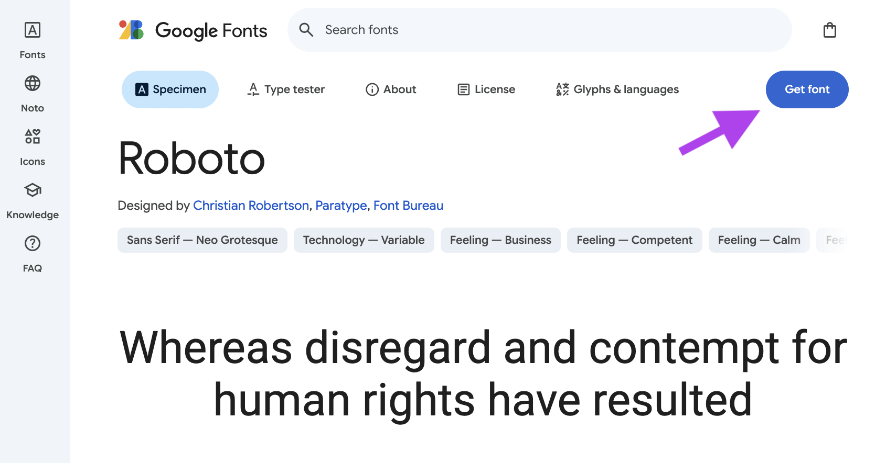
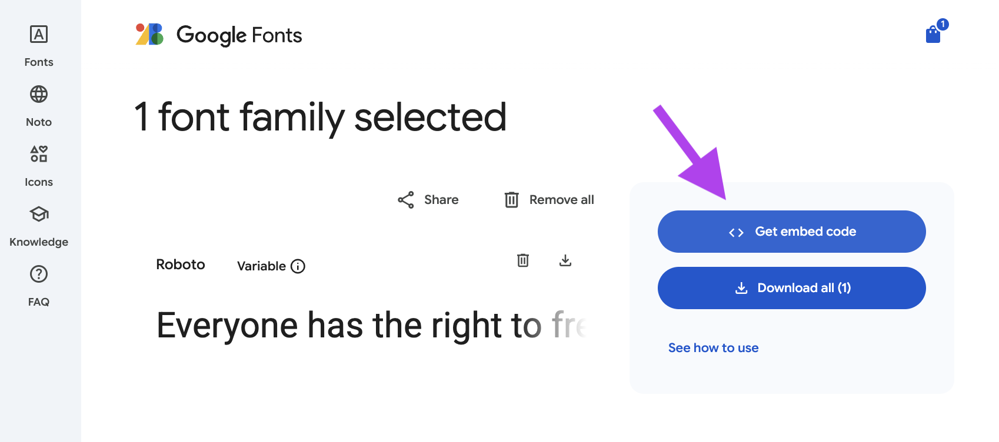
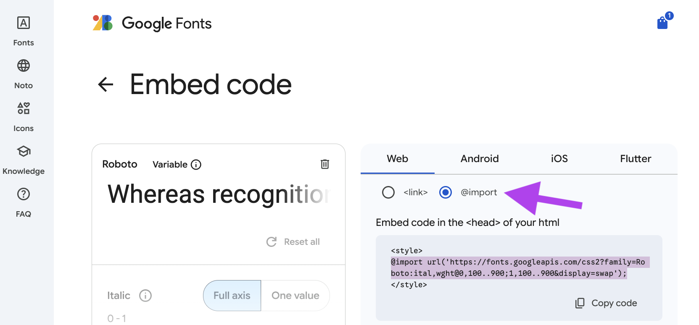

# 🔤 How to Import Custom Fonts
{:.no_toc}

### Google Fonts CSS-loading method with `@import`

There are multiple ways to load custom fonts into your webpage, but the simplest method is to keep everything style-related in the **CSS file**. 

1. Open your web browser and go to [Google Fonts](https://fonts.google.com).
2. Browse or search for the font you want to use.
3. **Click** on a font to view its details.
4. Add it to your "shopping cart"  🛒 by clicking <button class="btn btn-blue">Get Font</button>.
   
   > You can still go back and pick more **font families** before importing them in the steps below!
6. After selecting your fonts, click on the <button class="btn btn-blue">View Selected Families</button> (shopping bag icon 🛍️) button at the top-right corner of the page.
   
8. Find and select the `@import` option under <button class="btn btn-blue">Get Embed Code</button>.
   
9. Copy the generated statement only from `@import` until the semicolon `;`.
   <div class="warn" markdown="block">
     🚫 **DO NOT INCLUDE** the `<style></style>` tags around the statement! Those are for if you're loading the font via a HTML method, not the CSS way.
   </div>
10. Open your `style.css` file in your project.
11. Paste the `@import` statement at the very **TOP of your CSS file**, above any selectors. _Example:_
   ```css
   @import url('https://fonts.googleapis.com/css2?family=Roboto:ital,wght@0,100..900;1,100..900&display=swap');
   ```
11. Use the `font-family` property to **apply** the font to your elements. _Example:_
   ```css
   body {
      font-family: "Roboto", sans-serif;
   }
   ```
   <div class="highlight" markdown="block">
      Put the `font-family` CSS rule inside a **more specific selector**, like `h1` or `.class-name`, to apply a certain font more sparingly. _See below for examples._
   </div>

#### Full Example (with multiple fonts):
```css
@import url('https://fonts.googleapis.com/css2?family=Dancing+Script:wght@400..700&family=Oswald:wght@200..700&family=Roboto:ital,wght@0,100..900;1,100..900&display=swap');

/* General font applied to most of the page */
body {
  font-family: "Roboto", sans-serif;
}

/* Display-style font for headings only */
h1, h2, h3 {
   font-family: "Oswald", sans-serif;
}

/* Unique font for a specific class */
.standout {
  font-family: "Dancing Script", cursive;
}
```
