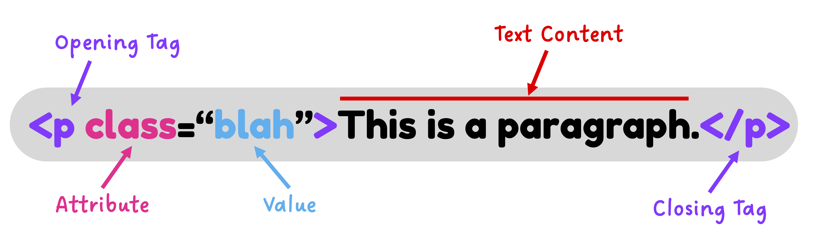

# 🧱 HTML Cheatsheet
{:.no_toc}

### Inline Elements
By default, **inline elements** appear next to one another in a webpage. They _take up only as much width as they need_ in a page and fit together horizontally like words in a sentence or books shelved side-by-side in a row. 

| Usage | Tag | Example |
| :---: | :---: | :--- |
| 📦 Inline Container | `` | Used to **group** sections of text: `Special style text` |
| 🔗 Link | `<a>` | `<a href="https://example.org">A link to example.org</a>` |
| 🖼️ Image | `` | No end tag, but the `src` **attribute** is required: `` |
| ↩ Line Break | ` ` | No end tag, just insert ` ` anywhere for a break with **blank space** |
| _Emphasize Text_ | `<em>` | `<em>I am in italics</em>` |
| **Important Text** | `<strong>` | `<strong>I am bold!</strong>` |

### Block Elements
**Block elements**, on the other hand, _take up the entire width_ of a webpage by default. They also take up a full line of a webpage; they do not fit together side-by-side. Instead, they stack like paragraphs in an essay or toy blocks in a tower.

| Usage | Tag | Example |
| :---: | :---: | :--- |
| 📦 Block Container | `
` | Used to **group** elements: `

` |
| 💬 Paragraph | `
` | `
I am a paragraph of text
` |
| 📣 Heading Text | `<h1>`-`<h6>` | `<h1>Primary heading</h1>` `<h2>Secondary heading</h2>` |
| ➖ Horizontal Line | `
` | No end tag, just insert `
` anywhere for a break with a **horizontal border** |
