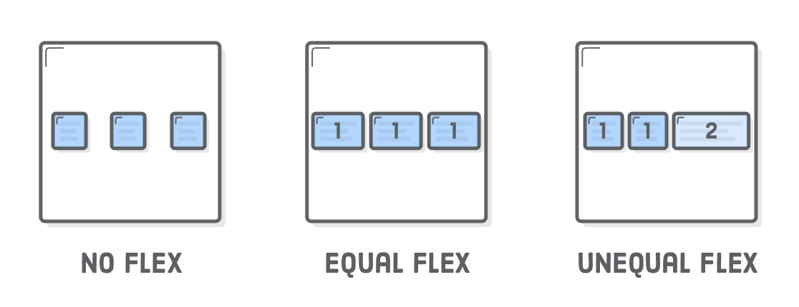
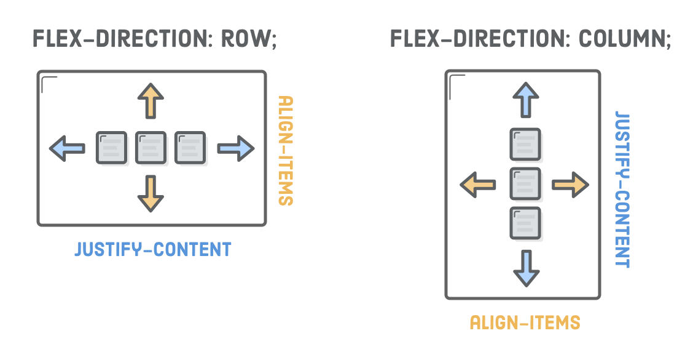
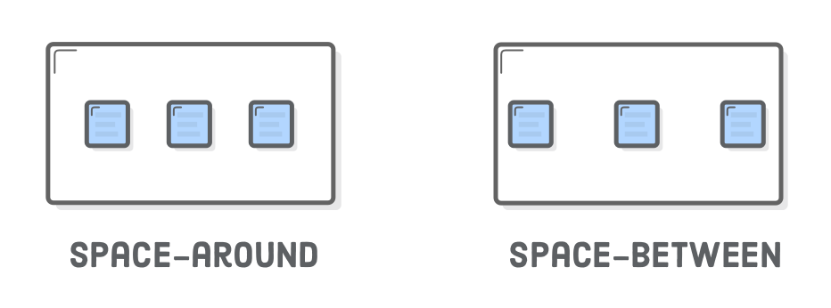

## Table of Contents
{: .no_toc .text-delta }

{: .fs-2 }
- TOC
{:toc}

---
## Flexbox Layouts

As you'll learn, there are *many* ways to move elements around on a web page. New methods have been developed over the years and older things have fallen out of style. Flexbox was not always available in CSS - its debut was *revolutionary*. Learn more about the [history of flexbox](https://medium.com/@BennyOgidan/history-of-css-grid-and-css-flexbox-658ae6cfe6d2).

Many resources put it near the end of their curriculum because it is somewhat new as a technology. But at this point, it has become the **default way of positioning elements** for many developers. Flexbox will be one of the most used tools in your toolbox, so why not learn it first?

- You will learn how to position elements using **flexbox**.
- You will learn about `flex containers` and `flex items`.
- You will learn how to create useful components and layouts that go beyond just stacking and centering items.

### Let's flex!
{: .no_toc }

Flexbox is a way to arrange items into **rows** or **columns**. These items will flex (i.e. _grow_ or _shrink_) based on some rules that you can define. Here are some examples of what you can control in flexible containers:


We've embedded a lot of interactive examples in this lesson. Take your time to experiment with them as you go to cement the concepts in your mind!

<p class="codepen" data-height="400" data-default-tab="html,result" data-slug-hash="QWgNxrp" data-editable="true" data-user="TheOdinProjectExamples" style="height: 400px; box-sizing: border-box; display: flex; align-items: center; justify-content: center; border: 2px solid; margin: 1em 0; padding: 1em;">

  <span>See the Pen <a href="https://codepen.io/TheOdinProjectExamples/pen/QWgNxrp">
  first flex example</a> by TheOdinProject (<a href="https://codepen.io/TheOdinProjectExamples">@TheOdinProjectExamples</a>)
  on <a href="https://codepen.io">CodePen</a>.</span>

</p>

<script async src="https://cpwebassets.codepen.io/assets/embed/ei.js"></script>

{:.highlight}
All 3 divs should be arranged **horizontally**. If you resize the results frame with the "1x", ".5x" and ".25x" buttons you'll also see that the divs will "flex". They will fill the available area and will each have equal width.

If you add another `div` to the HTML, inside of `<div class="flex-container">`, it will show up alongside the others, and everything will flex to fit within the available area.

### Flex Containers and Flex Items

As you've seen, flexbox is not just a single CSS **property** but a whole toolbox of properties that you can use to put things where you need them. Some of these properties belong on the *flex container*, while some go on the *flex items*. This is an important concept!


<div class="imp" markdown="block">
  
<span id="flex-container-item-knowledge-check">A **flex container** is any element that has `display: flex` on it. A **flex item** is any element that lives directly _inside_ of a flex container.</span>

</div>

{: #how-to-create-flex-item-knowledge-check}

Somewhat confusingly, any element can be both a flex container *and* a flex item. Said another way, you can also put `display: flex` on a flex item and then use flexbox to arrange *its* children.


Creating and nesting multiple flex containers and items is the primary way we will be building up complex layouts. The following image was achieved using *only* flexbox to arrange, size, and place the various elements. Flexbox is a *very* powerful tool.


---
## Growing & Shrinking Items



### The flex shorthand
{: .no_toc }

The `flex` declaration is actually a **shorthand** for 3 properties that you can set on a flex item. These properties affect _how flex items size themselves_ within their container. You've seen some shorthand properties before, like `border`, but we haven't officially defined them yet.

> **Shorthand properties** are CSS properties that let you _set the values of multiple CSS properties_ simultaneously. Using a shorthand property, you can write more concise (and often more readable) stylesheets, saving time and energy.
>
> MORE INFO: [Shorthand properties on MDN](https://developer.mozilla.org/en-US/docs/Web/CSS/Shorthand_properties)

<div class="imp" markdown="block">

The `flex` property is actually a shorthand for:
1. `flex-grow`
2. `flex-shrink`
3. `flex-basis`

</div>

Very often you see the flex shorthand defined with only *one* value. In that case, that value is applied to `flex-grow`. So when we put `flex: 1` on our divs, we were actually specifying a shorthand of `flex: 1 1 0`.

```css
div {
  flex: 1;
}
```
> In the above code, `flex: 1` equates to: `flex-grow: 1`, `flex-shrink: 1`, `flex-basis: 0`.


#### Flex-grow
{: .no_toc }

`flex-grow` expects a single number as its value, and that number is used as the flex-item's **"growth factor"**. When we applied `flex: 1` to every div inside our container, we were telling every div to grow the same amount. The result of this is that every div ends up the **exact same size**. 
> If we instead add `flex: 2` to just one of the divs, then that div would **grow** to 2x the size of the others. 

In the following example the `flex` shorthand has values for `flex-shrink` and `flex-basis` specified with their default values.

<p class="codepen" data-height="300" data-default-tab="html,result" data-slug-hash="YzQqvgK" data-editable="true" data-user="TheOdinProjectExamples" style="height: 300px; box-sizing: border-box; display: flex; align-items: center; justify-content: center; border: 2px solid; margin: 1em 0; padding: 1em;"> 
  
  <span>See the Pen <a href="https://codepen.io/TheOdinProjectExamples/pen/YzQqvgK">
  flex-grow example</a> by TheOdinProject (<a href="https://codepen.io/TheOdinProjectExamples">@TheOdinProjectExamples</a>)
  on <a href="https://codepen.io">CodePen</a>.</span> 
  
</p>

<script async src="https://cpwebassets.codepen.io/assets/embed/ei.js"></script>

#### Flex-shrink
{: .no_toc }

`flex-shrink` is similar to `flex-grow`, but sets the **"shrink factor"** of a flex item. `flex-shrink` only ends up being applied if the size of all flex items is _larger than their parent_ container. 
> For example, if our 3 divs from above had a width declaration like: `width: 100px`, and `.flex-container` was smaller than `300px`, our divs would have to shrink to fit.

{:.highlight}
The **default shrink factor** is `flex-shrink: 1`, which means all items will **shrink evenly**. If you do *not* want an item to shrink then you can specify `flex-shrink: 0;`. You can also specify higher numbers to make certain items shrink at a higher rate than normal.

Here's an example: 

<p class="codepen" data-height="300" data-default-tab="html,result" data-slug-hash="JjJXZVz" data-editable="true" data-user="TheOdinProjectExamples" style="height: 300px; box-sizing: border-box; display: flex; align-items: center; justify-content: center; border: 2px solid; margin: 1em 0; padding: 1em;">
  
  <span>See the Pen <a href="https://codepen.io/TheOdinProjectExamples/pen/JjJXZVz">
  flex-shrink example</a> by TheOdinProject (<a href="https://codepen.io/TheOdinProjectExamples">@TheOdinProjectExamples</a>)
  on <a href="https://codepen.io">CodePen</a>.</span>

</p>

<script async src="https://cpwebassets.codepen.io/assets/embed/ei.js"></script>

> Note that we've also changed the `flex-basis` for reasons that will be explained shortly. If you shrink your browser window, you'll notice that `.two` never gets smaller than the given width of 250px, even though the `flex-grow` rule would otherwise specify that each element should be equally sized.

<div class="warn" markdown="1">
  
An important implication to notice here is that when you specify `flex-grow` or `flex-shrink`, flex items do not necessarily respect your given values for `width`!

In the above example, all 3 divs are given a width of 250px, but when their parent is **big** enough, they _grow to fill it_. Likewise, when the parent is too **small**, the default behavior is for them to _shrink to fit_. This is not a bug, but it could be confusing behavior if you aren't expecting it.

</div>

#### Flex-basis
{: .no_toc }

`flex-basis` sets the **initial size** of a flex item, so any sort of `flex-grow`ing or `flex-shrink`ing starts from that baseline size. The shorthand value defaults to `flex-basis: 0%`. 
> The reason we had to change it to `auto` in the `flex-shrink` example is that with the basis set to `0`, those items would ignore the item's width, and everything would shrink evenly. Using `auto` as a flex-basis tells the item to **check for a width declaration** (`width: 250px`).

{:.warning}
There is a difference between the **default value** of `flex-basis` and the way the `flex` shorthand defines it if no `flex-basis` is given. The actual default value for `flex-basis` is `auto`, but when you specify `flex: 1` on an element, it interprets that as `flex: 1 1 0`. 

If you want to *only* adjust an item's `flex-grow` you can do so directly, without the shorthand. Or you can be more verbose and use the full 3 value shorthand `flex: 1 1 auto`, which is also equivalent to using `flex: auto`.

{:.highlight}
In practice you will likely not be using complex values for `flex-grow`, `flex-shrink` or `flex-basis`. Generally, you're most likely to use declarations like `flex: 1;` to make items **grow evenly** and `flex-shrink: 0` to **prevent shrinking** of certain items.

---
## Flexbox Axes

Let's see how the **orientation** of items within a flex container can be controlled using the `flex-direction` property.

- You'll learn about the 2 "axes" of a flex container.
- You'll learn how to change those axes to arrange your content in **columns** instead of **rows**.

### The `flex-direction` property

The most confusing thing about flexbox is that it can work either **horizontally** or **vertically**, and some rules change a bit depending on which direction you are working with.


<div class="imp" markdown="block">

The **default direction** for a flex container is **horizontal**, or `row`, but you can change the direction to **vertical**, or `column`. The direction can be specified in CSS like so:

```css
.flex-container {
  display: flex;
  flex-direction: column;
}
```

</div>

<span id='flex-axes'>No matter which direction you're using, you need to think of your flex-containers as having 2 axes: the **main axis** and the **cross axis**. It is the _direction_ of these axes that changes when the `flex-direction` is changed. In *most* circumstances, `flex-direction: row` puts the main axis horizontal (left-to-right), and `column` puts the main axis vertical (top-to-bottom).</span>

> In other words, in our very first example, we put `display: flex` on a div and it arranged its children horizontally. This is a demonstration of `flex-direction: row`, the default setting. 

The following example is very similar. If you uncomment the line that says `flex-direction: column`, those divs will stack vertically:

<p class="codepen" data-height="400" data-default-tab="html,result" data-slug-hash="BaZKPdw" data-editable="true" data-user="TheOdinProjectExamples" style="height: 400px; box-sizing: border-box; display: flex; align-items: center; justify-content: center; border: 2px solid; margin: 1em 0; padding: 1em;">

  <span>See the Pen [flex-direction example](https://codepen.io/TheOdinProjectExamples/pen/BaZKPdw) by TheOdinProject ([@TheOdinProjectExamples](https://codepen.io/TheOdinProjectExamples))
  on [CodePen](https://codepen.io).</span>

</p>

<script async src="https://cpwebassets.codepen.io/assets/embed/ei.js"></script>

One thing to note is that in this example, `flex-direction: column` would not work as expected if we used the shorthand `flex: 1`. Try it out now (i.e. go change the flex value on the `flex: 1 1 auto;` line). Can you figure out why it does not work if `flex: 1` is used? The divs collapse, even though they *clearly* have a `height` defined there.

The reason for this is that the <span id='row-flex-basis'> flex shorthand expands `flex-basis` to `0`, which means that all `flex-grow`ing and `flex-shrink`ing would begin their calculations from `0`.</span> Empty divs by default have 0 height, so for our flex items to fill up the height of their container, they don't actually need to have any height at all.

The example above fixed this by specifying `flex: 1 1 auto`, telling the flex items to default to their given `height`. We could also have fixed it by putting a height on the parent `.flex-container`, or by using `flex-grow: 1` instead of the shorthand.

Another detail to notice: when we changed the <span id='column-flex-basis'>flex-direction to `column`, `flex-basis` refers to `height` instead of `width`.</span> Given the context this may be obvious, but it's something to be aware of.

We've strayed from the point slightly... We were talking about flex-direction and axes. To bring it back home, the default behavior is `flex-direction: row` which arranges things horizontally. The reason this often works well without changing other details in the CSS is because block-level elements default to the full width of their parent. Changing things to vertical using `flex-direction: column` adds complexity because block-level elements default to the height of their content, and in this case there *is* no content.

> There are situations where the behavior of flex-direction could change if you are using a language that is written top-to-bottom or right-to-left, but you should save worrying about that until you are ready to start making a website in Arabic or Hebrew.

---
## Flexbox Alignment

So far everything we've touched with flexbox has used the rule `flex: 1` on all flex items, which makes the items grow or shrink equally to fill all of the available space. Very often, however, this is not the desired effect. Flex is also very useful for arranging items that have a specific size.

- You'll learn how to **align items** inside a flex container both **vertically** and **horizontally**.

### The `justify-content` and `align-items` properties



Let's look at an example:

<p class="codepen" data-height="400" data-default-tab="html,result" data-slug-hash="MWoyBzR" data-editable="true" data-user="TheOdinProjectExamples" style="height: 400px; box-sizing: border-box; display: flex; align-items: center; justify-content: center; border: 2px solid; margin: 1em 0; padding: 1em;">

  <span>See the Pen <a href="https://codepen.io/TheOdinProjectExamples/pen/MWoyBzR">
  flex-alignment example</a> by TheOdinProject (<a href="https://codepen.io/TheOdinProjectExamples">@TheOdinProjectExamples</a>)
  on <a href="https://codepen.io">CodePen</a>.</span>

</p>

<script async src="https://cpwebassets.codepen.io/assets/embed/ei.js"></script>

> You should be able to predict what happens if you put `flex: 1` on the `.item` by now. Give it a shot before we move on!

Adding `flex: 1` to `.item` makes each of the items grow to fill the available space, but what if we wanted them to stay the same width, but distribute themselves differently inside the container? 
> Remove `flex: 1` from `.item` and add `justify-content: space-between` to `.container`. 

#### When to use Justify-Content
{:.no_toc}

{:.important}
`justify-content` aligns items across the **main axis**. 

There are a few values that you can use here. For now try changing it in your code to `center`, which should _center the boxes along the main axis_.




#### When to use Align-Items
{:.no_toc}

{:.important}
To change the placement of items along the **cross axis** use `align-items`. 

In your code, try getting the boxes to the center of the container by adding `align-items: center` to `.container`. There are more options for this property: 


{:.warning}
Because `justify-content` and `align-items` are based on the **main axis** and **cross axis** of your container, their _behavior changes_ when you change the `flex-direction` of a flex container!  > For example, when you change `flex-direction` to `column`, `justify-content` aligns **vertically** and `align-items` aligns **horizontally**. 

The most common behavior, however, is the default, i.e. `justify-content` aligns items **horizontally** (because the main axis defaults to horizontal), and `align-items` aligns them **vertically**. 

#### Setting a Gap between flex items
{: .no_toc }

One very useful feature of flex is the `gap` property. 

<div class="imp" markdown="block">

Setting the `gap` property on a flex container adds a **specified space** between flex items, similar to adding a margin to the items themselves. 

</div>

Adding `gap: 8px` to the centered example above produces the result below:

<p class="codepen" data-height="300" data-default-tab="html,result" data-slug-hash="qBjZyea" data-editable="true" data-user="TheOdinProjectExamples" style="height: 300px; box-sizing: border-box; display: flex; align-items: center; justify-content: center; border: 2px solid; margin: 1em 0; padding: 1em;">

  <span>See the Pen <a href="https://codepen.io/TheOdinProjectExamples/pen/qBjZyea">
  flex-alignment example</a> by TheOdinProject (<a href="https://codepen.io/TheOdinProjectExamples">@TheOdinProjectExamples</a>)
  on <a href="https://codepen.io">CodePen</a>.</span>

</p>

<script async src="https://cpwebassets.codepen.io/assets/embed/ei.js"></script>

There's more for you to learn in the articles below, but at this point you can surely see how immensely useful flexbox is. With just the properties we've already covered, you could already put together some impressive layouts!

---

#### Knowledge check
{: .no_toc }

<div class="task" markdown="1">

💬 **DISCUSS:** The following questions are an opportunity to reflect on key topics in this lesson. _If you can't answer a question, click on it to review the material._

1. [What is the difference between `justify-content` and `align-items`?](https://developer.mozilla.org/en-US/docs/Web/CSS/CSS_Flexible_Box_Layout/Aligning_Items_in_a_Flex_Container)
2. [What's the difference between `justify-content: space-between` and `justify-content: space-around`?](https://css-tricks.com/snippets/css/a-guide-to-flexbox/)
3. [How do you use flexbox to completely center a div inside a flex container?](https://developer.mozilla.org/en-US/docs/Web/CSS/CSS_Flexible_Box_Layout/Aligning_Items_in_a_Flex_Container)

</div>

#### Additional resources
{: .no_toc }

- 🔖 **Bookmark** this [FLEXBOX VISUAL CHEATSHEET](https://flexbox.malven.co/) !!! 
- 🐸 [Flexbox Froggy](https://flexboxfroggy.com/) is a funny little **game** for practicing moving things around with flexbox.
- 📚 **Articles:**
  - This beautiful [Interactive Guide to Flexbox](https://www.joshwcomeau.com/css/interactive-guide-to-flexbox/) covers everything you need to know. It will help reinforce concepts we've already touched on with some really fun and creative examples. Spend some time here, some of it should be review at this point, but the foundations here are important!
  - [Typical use cases of Flexbox](https://developer.mozilla.org/en-US/docs/Web/CSS/CSS_Flexible_Box_Layout/Typical_Use_Cases_of_Flexbox) is an MDN article that covers some more practical tips. Don't skip the interactive sections! Playing around with this stuff is how you learn it!
  - The [CSS Tricks "Guide to Flexbox"](https://css-tricks.com/snippets/css/a-guide-to-flexbox/) is a classic. The images and examples are super helpful. It would be a good idea to review parts 1-3 and part 5 (don't worry about the media query parts)
  - [Aligning Items in a Flex Container](https://developer.mozilla.org/en-US/docs/Web/CSS/CSS_Flexible_Box_Layout/Aligning_Items_in_a_Flex_Container) goes into more depth on the topic of axes and `align-items` vs `justify-content`.

---

#### Acknowledgement
{: .no_toc }

Content on this page is adapted from [The Odin Project](https://www.theodinproject.com/) and most images are from [Interneting is Hard](https://internetingishard.netlify.app/).

{: .fs-2 }

