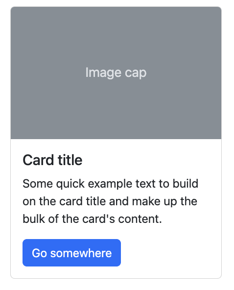
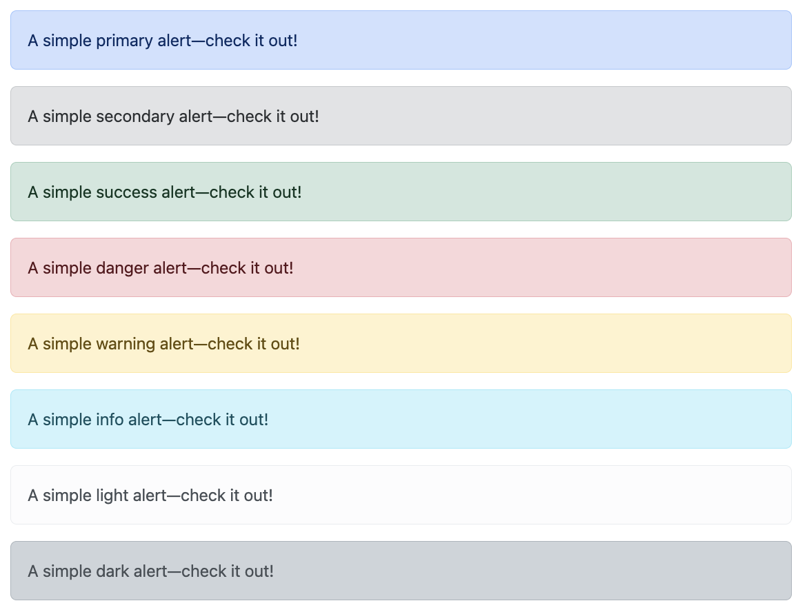
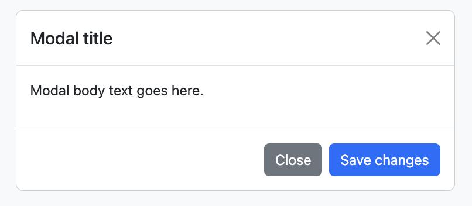

## Table of Contents
{: .no_toc .text-delta }

{: .fs-2 }
- TOC
{:toc}

---

## Bootstrap's User Interface (UI) Components

Bootstrap **components** are pre-styled, professional-looking UI elements like _buttons_, _forms_, _navigation bars_, and more – implemented simply by using Bootstrap's `class` names in your HTML code. 

<html>
<dl>
  <dt>User Interface</dt>
  <dd>The way a user interacts with a device, such as a computer, website, or application.</dd>
</dl>
</html>

<html>
<dl>
  <dt>UI Component</dt>
  <dd>A reusable building block of a user interface (UI) that displays content in a certain way or performs a specific function.</dd>
</dl>
</html>


<div class="imp" markdown="block">

📥 To use interactive elements like **carousels** (slideshows) and **modals** (pop-up windows), include the CDN link to Bootstrap's JavaScript code too (under your `<link>` to the CSS code):

```html

  <script src="https://cdn.jsdelivr.net/npm/bootstrap@5.3.3/dist/js/bootstrap.bundle.min.js"></script>
 
```
    
</div>

### Buttons

Bootstrap 5 provides nine predefined styles for **buttons** — each serving a different _semantic_ purpose. 

<html>
<dl>
  <dt>Semantic</dt>
  <dd>In web design, semantic refers to the the practice of making design choices that convey the <strong>inherent meaning</strong> of the content on a webpage. For example, a <span style="color: #198754">green</span> colored alert message is often used to indicate that a user action was <em>successful</em>.</dd>
</dl>
</html>

{:.highlight}
Refer to Bootstrap's official documentation on <a href="https://getbootstrap.com/docs/5.3/components/buttons/"><button type="button" name="button" class="btn">📖 Buttons</button></a> for more examples beyond those listed below.

To style a button, use Bootstrap's `.btn` class, followed by the desired style. For example, `class="btn btn-primary"` results in a primary colored button.


```html
<button type="button" class="btn btn-primary">Primary</button>
<button type="button" class="btn btn-secondary">Secondary</button>
<button type="button" class="btn btn-light">Light</button>
<button type="button" class="btn btn-dark">Dark</button>
```

#### Outline Buttons
{:.no_toc}

In need of a button, but not the hefty background colors they bring? Replace the default modifier classes with the `.btn-outline-*` ones to remove all background images and colors on any button.


```html
<button type="button" class="btn btn-outline-primary">Primary Outline</button>
```

#### Sizes
{:.no_toc}

Fancy larger or smaller buttons? Add `.btn-lg` or `.btn-sm` for additional sizes.

```html
<button type="button" class="btn btn-primary btn-lg">Larger</button>
<button type="button" class="btn btn-primary btn-sm">Smaller</button>
```

### Badges

Bootstrap's **badge** classes can be used to highlight additional information that's appended to a string of text. 

{:.highlight}
Refer to Bootstrap's official documentation on <a href="https://getbootstrap.com/docs/5.3/components/badge/"><button type="button" name="button" class="btn">📖 Badges</button></a> for more examples beyond those listed below.

To create a badge, apply the `.badge` class, as well as one of the `.bg-*` contextual classes to the `<span>` element that represents the badge.


```html
<h1>Example heading <span class="badge text-bg-primary">New</span></h1>
<h2>Example heading <span class="badge text-bg-secondary">New</span></h2>
```

### Cards

A **card** is a container with light styling that you can place virtually any content into. It can make your pages look clear and cohesive! Plenty of styling options are available such as alignment, padding, colors, headings, and more. 

{:.highlight}
Refer to Bootstrap's official documentation on <a href="https://getbootstrap.com/docs/5.3/components/card/"><button type="button" name="button" class="btn">📖 Cards</button></a> for more examples beyond those listed below.



To create a basic card:
* Apply the `.card` and `.card-body` classes to an element to create the outer card container.
* Add `.card-title` to any heading elements and `.card-text` to text elements.
  ```html
  <div class="card" style="max-width: 18rem;">
    <div class="card-body">
      <h5 class="card-title">Card title</h5>
      <p class="card-text">Some quick example text to make up the bulk of the card's content.</p>
      <a href="#" class="btn btn-primary">Go somewhere</a>
    </div>
  </div>
  ```
* You can add a **header** with `.card-header`, or a **card image** with `.card-img-top`:
  ```html
  <div class="card" style="max-width: 18rem;">
    <h5 class="card-header">Sponsored</div>
    
    <div class="card-body">
      <h5 class="card-title">Card title</h5>
      <p class="card-text">Some quick example text to make up the bulk of the card's content.</p>
      <a href="#" class="btn btn-primary">Go somewhere</a>
    </div>
  </div>
  ```

### Alerts

Bootstrap provides an easy way to create a stylized alert message box with its **alert** component. Alerts make messages stand out, and can also offer contextual feedback messages for typical user actions.

{:.highlight}
Refer to Bootstrap's official documentation on <a href="https://getbootstrap.com/docs/5.3/components/alerts//"><button type="button" name="button" class="btn">📖 Alerts</button></a> for more examples beyond those listed below.

To create an alert box, use the `.alert` class along with one of the `.alert-*` classes to specify the kind of alert.



```html
<div class="alert alert-success" role="alert">
  A simple success alert—check it out!
</div>
<div class="alert alert-danger" role="alert">
  A simple danger alert—check it out!
</div>
```

<!--

#### Interactive Alert
{:.no_toc}

In this example, the button can be **clicked** to show an alert (hidden with inline styles to start), then **dismissed** (and destroy) with the built-in close button.


```html
<div id="liveAlertPlaceholder"></div>
<button type="button" class="btn btn-primary" id="liveAlertBtn">Show live alert</button>
```
-->

### Modals

Bootstrap enables you to add a **modal** dialog box (pop-up window) to your site. A modal is a dialog box that takes the focus while the rest of the screen is dimmed or grayed out. This forces the user to take action on the dialog box before continuing. 

{:.highlight}
Refer to Bootstrap's official documentation on <a href="https://getbootstrap.com/docs/5.3/components/modal/"><button type="button" name="button" class="btn">📖 Modals</button></a> for more examples beyond those listed below.

Below is a _static_ modal example (meaning its `position` and `display` have been overridden). Included are the modal **header**, modal **body** (required for padding), and modal **footer** (optional). 



To create a modal, use the `.modal` class along with various other `.modal-*` classes to define each section of the modal.

```html
<!-- Button trigger modal -->
<button type="button" class="btn btn-primary" data-bs-toggle="modal" data-bs-target="#exampleModal">
  Launch Modal
</button>

<!-- Modal -->
<div class="modal fade" id="exampleModal" tabindex="-1" aria-labelledby="exampleModalLabel" aria-hidden="true">
  <div class="modal-dialog">
    <div class="modal-content">
      <div class="modal-header">
        <h1 class="modal-title fs-5" id="exampleModalLabel">Modal title</h1>
        <button type="button" class="btn-close" data-bs-dismiss="modal" aria-label="Close"></button>
      </div>
      <div class="modal-body">
        ...
      </div>
    </div>
  </div>
</div>

```

### Carousels

The Bootstrap **carousel** component enables you to add scrolling images and text that slide in, pause, then slide out. Controls enable the user to scroll forwards or backwards within the set. Basically a scrolling _slideshow_ with (optional) user controls. 

{:.highlight}
Refer to Bootstrap's official documentation on <a href="https://getbootstrap.com/docs/5.3/components/carousel/"><button type="button" name="button" class="btn">📖 Carousels</button></a> for more examples beyond those listed below.


To create a basic carousel with **autoplay** (no controls):

* Apply `.carousel` and `.slide` to an outer container (with its own **unique ID**).
* For the scrollable contents, wrap all items in a `.carousel-inner` and give each item a `.carousel-item` class.
* Also, you must apply `.active` to one of the slides in the carousel, otherwise the carousel won't be visible. This class allows you to set one slide as the initial slide (i.e. the starting slide).
* Use the `data-bs-ride` attribute to **auto-play** the carousel.

```html
<div id="carouselExample" class="carousel slide" data-bs-ride="carousel">
  <div class="carousel-inner">
    <div class="carousel-item active">
      
    </div>
    <div class="carousel-item">
      
    </div>
    <div class="carousel-item">
      
    </div>
  </div>
</div>
```

---

#### Acknowledgement
{: .no_toc }

Content on this page is adapted from [Bootstrap 5 Tutorial - Quackit](https://www.quackit.com/bootstrap/bootstrap_5/tutorial/) and the [Bootstrap Documentation](https://getbootstrap.com/).
{: .fs-2 }
