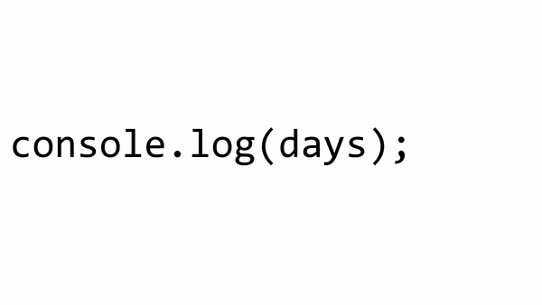
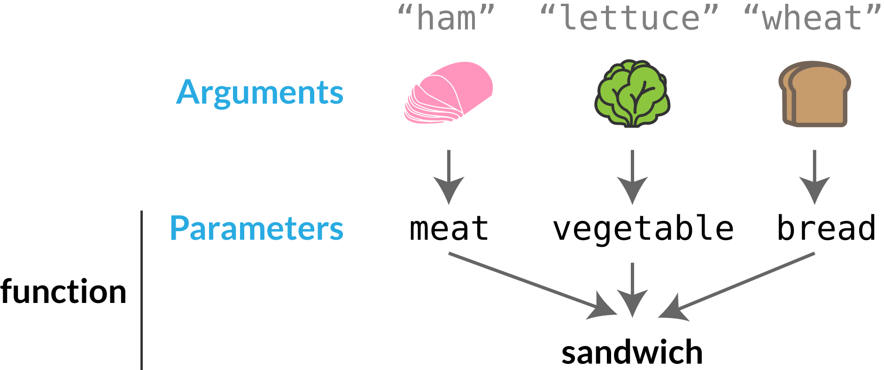

## Table of Contents
{: .no_toc .text-delta }

{: .fs-2 }
- TOC
{:toc}

---

## Variables & Data Types

Most of the time, a JavaScript application needs to work with **data** (information). Here are two examples:
1. An online shop - the information might include goods being sold and a shopping cart.
2. A chat application - the information might include users, messages, and much more.

In programming languages, a [variable](https://en.wikipedia.org/wiki/Variable_(computer_science)) is a "named storage container" for data. **Variables** are used to _store_ information.

<div class="imp" markdown="block">

- **DATA** is information 🧠
- **VARIABLES** store data → *like a **box*** 📦
- **IDENTIFIERS** are the names we give variables → *like a **label** on the box* 🏷️
- **DATA TYPES** are the categories of information → *like the **size/shape** of the box*
    
</div>

#### JS DATA TYPES
{:.no_toc}

| `Number` | 🔢 a **quantity/amount** that is either a **whole/integer** number or a **decimal/fractional** number |
| `String` | 🔤 a collection of **individual characters** (letters/numbers/symbols) that are “*strung together*” to form **text/words/sentences** |
| `Boolean` | either `true` or `false` |
| `Array` | a **list** of multiple values, each value has an **index** number that indicates its position/order in the collection  |
| `Object` | *custom* data types that hold a **group** of data, usually to represent a real-world object or an HTML document |

### Creating Variables

To create a variable in JavaScript, use the `let` keyword.

The statement below creates (in other words: *declares*) a variable with the name "message":

```js
let message;
```

Now, we can put some data into it by using the assignment operator `=`:

```js
// Store the string 'Hello' in the variable named message
message = 'Hello';
```

We can grasp the concept of a "variable" if we imagine it as a "box" for data, with a uniquely-named "label" stuck on it for easy retrieval. For instance, the variable `message` can be imagined as a box labelled `"message"` with the value `"Hello!"` in it:


> We can put any value in the box.

The string is now saved into the memory area associated with the variable. We can access it using the variable name:

```js
let message;
message = 'Hello!';

console.log(message); // shows the variable content
```

#### `var` instead of `let`
{:.no_toc}

In older scripts, you may also find another keyword: `var` instead of `let`:

```js
var message = 'Hello';
```

The `var` keyword is *almost* the same as `let`. It also declares a variable but in a slightly different, "old-school" way.

There are subtle differences between `let` and `var`, but they do not matter to us yet. 

We can also **change** it as many times as we want:

```js
let message;

message = 'Hello!';

message = 'World!'; // value changed

console.log(message);
```

When the value is changed, the old data is removed from the variable:


We can also declare two variables and copy data from one into the other.

```js
let hello = 'Hello world!';

let message;

// copy 'Hello world' from hello into message
message = hello;

// now two variables hold the same data
console.log(hello); // Hello world!
console.log(message); // Hello world!
```

<div class="warn" markdown="block">

A variable should be **DECLARED** only once. A repeated declaration of the same variable triggers an error:

```js
let message = "This";

// repeated 'let' leads to an error
let message = "That"; // SyntaxError: 'message' has already been declared
```
So, we should declare a variable once and then refer to it without `let`.

</div>


#### The Assignment Operator
{:.no_toc}

<!--
[A Visual Guide to Understanding Variables in JavaScript](https://blog.codeanalogies.com/2017/12/20/a-visual-guide-to-understanding-the-sign-in-javascript/)

[How JavaScript variable scoping is just like multiple levels of government](https://blog.codeanalogies.com/2017/11/22/how-javascript-variable-scoping-is-just-like-multiple-levels-of-government/)
-->

<iframe width="560" height="315" src="https://www.youtube.com/embed/cXUWYZXru6o?si=sB54GV-STb2ipVhL" title="YouTube video player" frameborder="0" allow="accelerometer; autoplay; clipboard-write; encrypted-media; gyroscope; picture-in-picture; web-share" referrerpolicy="strict-origin-when-cross-origin" allowfullscreen></iframe>

- **VARIABLES** are containers for *carrying values* within your script


- This is called **declaring** a variable. It creates a new truck called *days* that can drive around your script and deliver its **value** OR pick up a new **value**.
- The `let` **KEYWORD (also** `var` but no one uses that anymore**)** allows us to create **mutable** variables whose values can be changed.
    - `let` announces that you are creating a new variable. Or, in the analogy we are about to use, buying a new truck.
    - If we used the `const` keyword, it would mean that the value is **immutable** and unchangeable.
- The variable needs a unique **name**, which is *days* here. This distinguishes this truck from all the other trucks.
- The **assignment operator**, or `=` sign, is NOT an “equals sign” like in math equations → it’s more like **a ramp that loads up a truck**
    - In this example, it loads the **value** 7, into the *days* truck
- The variable `days` is not “equal” to anything! It merely carries around the value that you assign to it.
- In JS, unlike math, you can simply **RE-ASSIGN** a new value to the variable later: `days = 5;` → the assignment operator loads a new value on to the *days* truck
- You can **PASS** a variable into **FUNCTIONS** like this:
    



<div class="task" markdown="block">

Complete the **Variables** section (steps 1-6) in the following _interactive tutorial_: 
[🏗️ JS Construction Site](https://www.codeanalogies.com/jsconstruction/)

</div>

### Arithmetic Operators

The following math operations are supported:

- Addition `+`,
- Subtraction `-`,
- Multiplication `*`,
- Division `/`,
- Remainder `%`,
- Exponentiation `**`.

The first four are straightforward, while `%` and `**` need a few words about them.

#### Remainder `%`
{:.no_toc}

The **remainder operator** `%`, despite its appearance, is not related to percents.

The result of `a % b` is the [remainder](https://en.wikipedia.org/wiki/Remainder) of the integer division of `a` by `b`.

```js
console.log( 5 % 2 ); // 1, the remainder of 5 divided by 2
console.log( 8 % 3 ); // 2, the remainder of 8 divided by 3
console.log( 8 % 4 ); // 0, the remainder of 8 divided by 4
```

#### Exponentiation `**`
{:.no_toc}

The **exponentiation operator** `a ** b` raises `a` to the power of `b`.
> In school math, we write that as: a<sup>b</sup>.

```js
console.log( 2 ** 2 ); // 2² = 4
console.log( 2 ** 3 ); // 2³ = 8
console.log( 2 ** 4 ); // 2⁴ = 16
```

Just like in math, the exponentiation operator is defined for non-integer numbers as well.

For example, a square root is an exponentiation by ½:

```js
console.log( 4 ** (1/2) ); // 2 (power of 1/2 is the same as a square root)
console.log( 8 ** (1/3) ); // 2 (power of 1/3 is the same as a cubic root)
```

### String Concatenation

Let's meet the features of JavaScript operators that are beyond school arithmetics.

Usually, the plus operator `+` sums numbers. But, if the binary `+` is applied to `strings`, it **concatenates** (_merges_) them:

```js
let s = "my" + "string";
console.log(s); 
```

Note that if any of the operands is a string, then the other one is **converted** to a string too. For example:

```js
console.log( '1' + 2 ); // "12"
console.log( 2 + '1' ); // "21"
```
> See, it doesn't matter whether the first operand is a string or the second one.

Here's a more complex example:

```js
console.log(2 + 2 + '1' ); // "41" and not "221"
```
> Here, operators work one after another. The first `+` sums two numbers, so it returns `4`, then the next `+` adds the string `1` to it, so it's like `4 + '1' = '41'`.

### Increment/Decrement

Increasing or decreasing a number by one is among the most common numerical operations.

So, there are special operators for it:

- **Increment** `++` increases a variable by 1:

    ```js
    let counter = 2;
    counter++; // works the same as counter = counter + 1, but is shorter
    console.log( counter ); 
    ```
- **Decrement** `--` decreases a variable by 1:

    ```js
    let counter = 2;
    counter--; // works the same as counter = counter - 1, but is shorter
    console.log( counter );
    ```

{:.warning}
Increment/decrement operators can only be applied to **variables**. Trying to use it on a _value_, like `5++`, will give an error.

---

## Functions

<div class="imp" markdown="block">
    
- **FUNCTIONS** are **reusable** sets of **code** **statements** that accomplish a specific task in a certain way
    - `console.log()` is a built-in **function** that **prints** data by *logging* information in the console
    - Inside the **parenthesis** (`()`) goes the data to be printed
    - Indicate `String` data by surrounding it with **quotations** (`””`) → 💬

</div>

```jsx
// Print a String to the console
console.log("Hello World!");
```

Let's think about the general concept of **cooking with a recipe** first. Using a recipe means that:

1. You start with a specific set of ingredients
2. You perform a specific procedure using those ingredients
3. You will get a reliable product at the end

- A **FUNCTION** is also a **reusable recipe** that performs the same set of actions over and over again on a set of ingredients.
- Those **ingredients** are called **PARAMETERS → “INPUT”**
- Some functions **RETURN** a value, which means that they ***give you a new value*** that you can then use throughout your script **→** “**OUTPUT”**


- Other functions **do not return** a value, instead, they might ***change a value that already exists*** in your script or carry out an action like `console.log()`
    - Think of it like chopping onions. There is no "new" product, just the same product in a new format.
    - Boiling water to make pasta is another example of a function that just “does/changes something” but doesn’t necessarily give you something new in return
    

    
- Check out the example below to see the general layout of a function. In this example, we are **DEFINING** **a function** (“documenting the recipe”) called `makeSandwich`.
    - It does **return** a value here: one full sandwich.
    - *Why is this useful in real life? Why is this useful in code?*
    

      
{:.highlight}
For a more in-depth description of the **recipe analogy**, check out this blog post: [JavaScript Functions Explained by Making a Recipe](https://www.codeanalogies.com/javascript-functions-explained#javascript)

### Writing Functions

<div class="task" markdown="block">

Complete the **Functions** section (steps 16-20) in the following _interactive tutorial_: 
[🏗️ JS Construction Site](https://www.codeanalogies.com/jsconstruction/)

</div>


---

#### Acknowledgement
{: .no_toc }

Content on this page is adapted from the [MDN Web Docs](https://developer.mozilla.org/en-US/docs/Web/JavaScript/Guide), [The Modern JavaScript Tutorial](https://javascript.info/), and [CodeAnalogies Blog](https://www.codeanalogies.com/).
{: .fs-2 }
