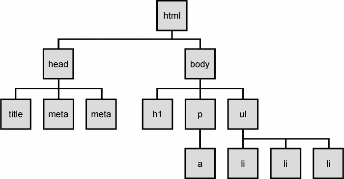

## Table of Contents
{: .no_toc .text-delta }

{: .fs-2 }
- TOC
{:toc}

---

## JavaScript for Webpage Interactions

<iframe width="560" height="315" src="https://www.youtube.com/embed/KShnPYN-voI?si=CweLbdCfRuLw3JYk" title="YouTube video player" frameborder="0" allow="accelerometer; autoplay; clipboard-write; encrypted-media; gyroscope; picture-in-picture; web-share" referrerpolicy="strict-origin-when-cross-origin" allowfullscreen></iframe>

---

## The DOM (Document Object Model)

The DOM is an API (Application Programming Interface) that allows you to use JavaScript to **make changes to an HTML document**. It’s the key to building _dynamic_ websites by linking JavaScript with HTML on the front-end.

🌳 You might have heard the DOM referred to as the _DOM tree_. That analogy hints at the **hierarchical structure** of an HTML document, but it can be a bit limiting when you’re learning how to navigate and manipulate it. 



There are two key concepts about the DOM:

1. **Containment** – _PARENT_ elements contain other elements (_CHILDREN_), and those children can contain their own children.
2. **Order** – DOM elements follow a specific order, which you can manipulate with JavaScript.

🗓️ Think of a **personal calendar**. In a calendar, the year contains months, and each month contains weeks. The same idea appears in HTML.

Consider this HTML:

```html
<div class="year" id="2018">
    <div class="month january">
        <div class="week"></div>
        <div class="week"></div>
        <div class="week"></div>
        <div class="week"></div>
    </div>
    <div class="month february">
        <div class="week"></div>
        <div class="week"></div>
        <div class="week"></div>
        <div class="week"></div>
    </div>
    <div class="month march">
        <div class="week"></div>
        <div class="week"></div>
        <div class="week"></div>
        <div class="week"></div>
    </div>
</div>
```

Each month is a `div` with the class `"month"` plus an additional class naming the month (like `"january"`). We also give the year a unique id (`"2018"`), making it easier to pinpoint specific sections of our document using CSS selectors.

{:.highlight}
So what’s the difference between the **JavaScript DOM** and the **HTML document**? Think of your calendar as a _record_ of your day-to-day activities – _not the actual events_. The HTML is the _raw content_ of your page, while the DOM is a _model_ that lets you interact with and change that content.

### Updating Text Content

Let’s say you want to represent a real-world habit in your calendar: playing soccer once a week during January. In HTML terms, you want to update each of the four week `div`s inside the January `div` to say “Soccer Practice.”

```html
<div class="month january">
    <div class="week"></div>
    <div class="week"></div>
    <div class="week"></div>
    <div class="week"></div>
</div>
```

💬 **DISCUSS:** Do you know what those 4 divs with class “week” have in common?
> They are all **children** of the div with class “january”!

#### Step 1: Select Elements Using CSS Selectors
{:.no_toc}

1. Select the year element by its id:
    ```js
    let year = document.querySelector('#2018');
    ```
2. Within that year, select the January month by its class:
    ```js
    let jan = year.querySelector('.january');
    ```
3. Finally, select ALL the week elements within January:
    ```js
    let weeks = jan.querySelectorAll('.week');
    ```

#### Step 2: Manipulate the DOM
{:.no_toc}

The function `.querySelectorAll` returns a **list** of elements - there are _multiple elements_ that meet the selection criteria. Now that we have the list of `week` elements, we **loop** through each element and update its `textContent` property:

```js
for (let week of weeks) {
  week.textContent = "Soccer Practice";
}
```

After running the script, your HTML will look like this:

```html
<div class="month january">
    <div class="week">Soccer Practice</div>
    <div class="week">Soccer Practice</div>
    <div class="week">Soccer Practice</div>
    <div class="week">Soccer Practice</div>
</div>
```

We did two things here:

1. **Traverse the DOM** – that means we used selectors to get the elements we need: the 4 ‘week’ divs
2. **Manipulate the DOM** – we actually changed the text content within the HTML elements!

---

#### Acknowledgement
{: .no_toc }

Content on this page is adapted from the [MDN Web Docs](https://developer.mozilla.org/en-US/docs/Web/JavaScript/Guide), [The Modern JavaScript Tutorial](https://javascript.info/), and [CodeAnalogies Blog](https://www.codeanalogies.com/).
{: .fs-2 }
