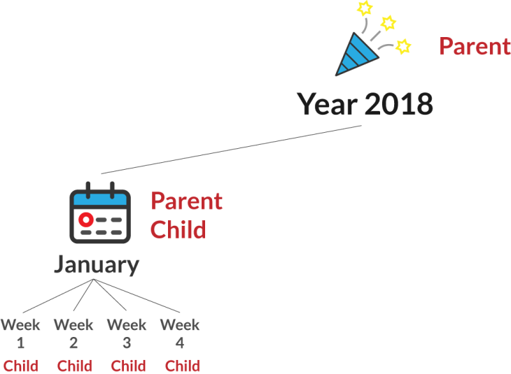

## Table of Contents
{: .no_toc .text-delta }

{: .fs-2 }
- TOC
{:toc}

---

## JavaScript for Webpage Interactions

<iframe width="560" height="315" src="https://www.youtube.com/embed/KShnPYN-voI?si=CweLbdCfRuLw3JYk" title="YouTube video player" frameborder="0" allow="accelerometer; autoplay; clipboard-write; encrypted-media; gyroscope; picture-in-picture; web-share" referrerpolicy="strict-origin-when-cross-origin" allowfullscreen></iframe>

---

## The DOM (Document Object Model)

The DOM is an API (Application Programming Interface) that allows you to use JavaScript to **make changes to an HTML document**. It is the key to building _dynamic_ websites and linking JS and HTML on the front-end.

Usually, the DOM is called the _DOM tree_. This sort of works to explain the basic idea since people understand the idea of tree branches and an infinite hierarchy of these branches:


But, the analogy is still so basic that you will struggle to understand the different relationships between elements in the DOM. There are two key concepts about the DOM:

1. **Containment** - _PARENT_ elements contain _CHILDREN_ elements. And those children contain their children elements.
2. **Order** - DOM elements have a definite order that you can _manipulate_.

The concept of a **personal calendar** demonstrates the complex relationships between elements in the DOM. 


Here is a quick diagram of the first three months of 2018:


In this case, the year contains three months, which each contain 4 weeks. Here is the exact same concept in HTML.

```html
<div class="year" id="2018">
    <div class="month january">
        <div class="week"></div>
        <div class="week"></div>
        <div class="week"></div>
        <div class="week"></div>
    </div>
    <div class="month february">
        <div class="week"></div>
        <div class="week"></div>
        <div class="week"></div>
        <div class="week"></div>
    </div>
    <div class="month march">
        <div class="week"></div>
        <div class="week"></div>
        <div class="week"></div>
        <div class="week"></div>
    </div>
</div>
```

Each month is a div that not only has the class of “month”, but also a class with a specific name of the month. This is because there are a nearly infinite number of years, so there are many cases of each class. The same structure is used on the div with class `year` on line 1.

So what is the difference between the DOM and actual HTML, you might be asking?

Well, think of the way you use a personal calendar. It is just a _record_ of the things that you do during your days. It is _not the actual activity_! In other words, it is a **model** of the stuff that goes on during the day.

{:.highlight}
The HTML is the actual content of your day. HTML elements make up the webpage, while the DOM is an accessible interface to direct changes.

Here are a few examples that will show these concepts in action.

#### Example: Playing Soccer Once A Week
{:.no_toc}

Okay, we are going to show how you would represent some real world habits in the DOM. Here’s the scenario: You want to play soccer once a week for the month of January.

In HTML terms, that means we need to get each of the 4 weeks in January, and change their content to: “Play soccer”.

Do you know what those 4 divs with class “week” have in common?

The answer: They are all children of the div with class “january”!

```html
<div class="month january">
    <div class="week"></div>
    <div class="week"></div>
    <div class="week"></div>
    <div class="week"></div>
</div>
```



So, we can use the following statement in JavaScript to get the div with class ‘january’.

```js
document.getElementsByClassName('january');
```

Then, we need all children of that div. We can update the previous statement with the childNodes property.

```js
document.getElementsByClassName('january').childNodes;
```

Finally, we need to use the nodeValue property to change the text for every element. And, we need to use a for loop to access element withing childNodes, since that returns an array of elements. So we need to iterate through that list.

```js
let weeks = document.getElementsByClassName('january').childNodes;
 
for(let i = 0; i < weeks.length; i++){
  weeks[i].nodeValue = &quot;Play soccer&quot;;
}
``` 

Here is the final result in HTML:

```html
<div class="month january">
    <div class="week">Play soccer</div>
    <div class="week">Play soccer</div>
    <div class="week">Play soccer</div>
    <div class="week">Play soccer</div>
</div>
```
We did two things here:

1. Traverse the DOM – that means we used selectors to get the elements we need: the 4 ‘week’ divs
2. Manipulate the DOM – we actually changed the text content within the HTML elements!


---

#### Acknowledgement
{: .no_toc }

Content on this page is adapted from the [MDN Web Docs](https://developer.mozilla.org/en-US/docs/Web/JavaScript/Guide), [The Modern JavaScript Tutorial](https://javascript.info/), and [CodeAnalogies Blog](https://www.codeanalogies.com/).
{: .fs-2 }
