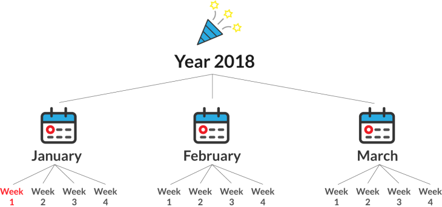

## Table of Contents
{: .no_toc .text-delta }

{: .fs-2 }
- TOC
{:toc}

---

## JavaScript for Webpage Interactions

<iframe width="560" height="315" src="https://www.youtube.com/embed/KShnPYN-voI?si=CweLbdCfRuLw3JYk" title="YouTube video player" frameborder="0" allow="accelerometer; autoplay; clipboard-write; encrypted-media; gyroscope; picture-in-picture; web-share" referrerpolicy="strict-origin-when-cross-origin" allowfullscreen></iframe> 

---

## The DOM (Document Object Model)

The DOM is an API (Application Programming Interface) that allows you to use JavaScript to **make changes to an HTML document**. It’s the key to building _dynamic_ websites by linking JavaScript with HTML on the front-end.

🌳 You might have heard the DOM referred to as the _DOM tree_. That analogy hints at the **hierarchical structure** of an HTML document, but it can be a bit limiting when you’re learning how to navigate and manipulate it. 


There are two key concepts about the DOM:

1. **Containment** – _PARENT_ elements contain other elements (_CHILDREN_), and those children can contain their own children.
2. **Order** – DOM elements follow a specific order, which you can manipulate with JavaScript.

🗓️ Think of a **personal calendar**. In a calendar, the year contains months, and each month contains weeks. The same idea appears in HTML.



Consider this HTML:

```html
<div class="year" id="2018">
    <div class="month january">
        <div class="week"></div>
        <div class="week"></div>
        <div class="week"></div>
        <div class="week"></div>
    </div>
    <div class="month february">
        <div class="week"></div>
        <div class="week"></div>
        <div class="week"></div>
        <div class="week"></div>
    </div>
    <div class="month march">
        <div class="week"></div>
        <div class="week"></div>
        <div class="week"></div>
        <div class="week"></div>
    </div>
</div>
```

Each month is a `div` with the class `"month"` plus an additional class naming the month (like `"january"`). We also give the year a unique id (`"2018"`), making it easier to pinpoint specific sections of our document using CSS selectors.

{:.highlight}
So what’s the difference between the **JavaScript DOM** and the **HTML document**? Think of your calendar as a _record_ of your day-to-day activities – _not the actual events_. The HTML is the _raw content_ of your page, while the DOM is a _model_ that lets you interact with and change that content.

### Updating Text Content

Let’s say you want to represent a real-world habit in your calendar: playing soccer once a week during January. In HTML terms, you want to update each of the four week `div`s inside the January `div` to say “Soccer Practice.”

```html
<div class="month january">
    <div class="week"></div>
    <div class="week"></div>
    <div class="week"></div>
    <div class="week"></div>
</div>
```

💬 **DISCUSS:** Do you know what those 4 divs with class “week” have in common?
> They are all **children** of the div with class “january”!


#### Step 1: Select Elements Using CSS Selectors
{:.no_toc}

1. Select the year element by its id:
    ```js
    let year = document.querySelector('#2018');
    ```
2. Within that year, select the January month by its class:
    ```js
    let jan = year.querySelector('.january');
    ```
3. Finally, select ALL the week elements within January:
    ```js
    let weeks = jan.querySelectorAll('.week');
    ```

#### Step 2: Manipulate the DOM
{:.no_toc}

The function `.querySelectorAll` returns a **list** of elements - there are _multiple elements_ that meet the selection criteria. Now that we have the list of `week` elements, we **loop** through each element and update its `textContent` property:

```js
for (let week of weeks) {
  week.textContent = "Soccer Practice";
}
```

After running the script, your HTML will look like this:

```html
<div class="month january">
    <div class="week">Soccer Practice</div>
    <div class="week">Soccer Practice</div>
    <div class="week">Soccer Practice</div>
    <div class="week">Soccer Practice</div>
</div>
```

We did two things here:

1. **Traverse the DOM** – that means we used selectors to get the elements we need: the 4 ‘week’ divs
2. **Manipulate the DOM** – we actually changed the text content within the HTML elements!

---

### Changing CSS Properties with JavaScript

Imagine you want not only to update the text for your Soccer Practice days, but also to visually highlight them by **changing the styling**. Perhaps you’d like to set a new background color, adjust the text color, add some padding, and even include a border to make the days stand out.

By blending JavaScript instructions with **CSS properties**, you can create interactive, visually engaging webpages. This approach lets you adapt the look and feel of your content on the fly, just as you might annotate your calendar to better highlight important events.

#### Step 1: Select the Elements Using CSS Selectors
{:.no_toc}

Just like before, we begin by selecting the elements we want to style. We break down our selectors into three clear steps:

```js
// Select the year element by its id
const year = document.querySelector('#2018');

// Within that year, select the January month by its class
const january = year.querySelector('.january');

// Finally, select all the week elements within January
const weeks = january.querySelectorAll('.week');
```

#### Step 2: Update CSS Properties
{:.no_toc}

With our target elements selected, we can now change their CSS properties using the `style` property in JavaScript. Here’s how you can do it:

```js
for (let week of weeks) {
  week.style.backgroundColor = 'lightblue';  // Change the background color
  week.style.color = 'darkblue';             // Set the text color
  week.style.padding = '10px';               // Add some padding for spacing
  week.style.border = '2px solid #ccc';       // Add a border around each week element
}
```

In this snippet, each week element in January gets styled with:
- **Background color** set to light blue
- **Text color** set to dark blue
- **Padding** of 10 pixels to give some space inside the element
- **A border** of 2 pixels in a light gray color to visually frame the content

#### The Result in the Browser
{:.no_toc}

Even though these changes are applied dynamically via JavaScript, if you inspect one of the week `div`s with your browser's developer tools, you'll see inline styles like this:

```html
<div class="week" style="background-color: lightblue; color: darkblue; padding: 10px; border: 2px solid #ccc;">Soccer Practice</div>
```
> The styles applied here are added directly to the elements (inline). While this is powerful for immediate changes, consider using CSS classes for larger projects to keep your styling organized.

---

## Events & Event Listeners


---

#### Acknowledgement
{: .no_toc }

Content on this page is adapted from the [MDN Web Docs](https://developer.mozilla.org/en-US/docs/Web/JavaScript/Guide), [The Modern JavaScript Tutorial](https://javascript.info/), and [CodeAnalogies Blog](https://www.codeanalogies.com/).
{: .fs-2 }
